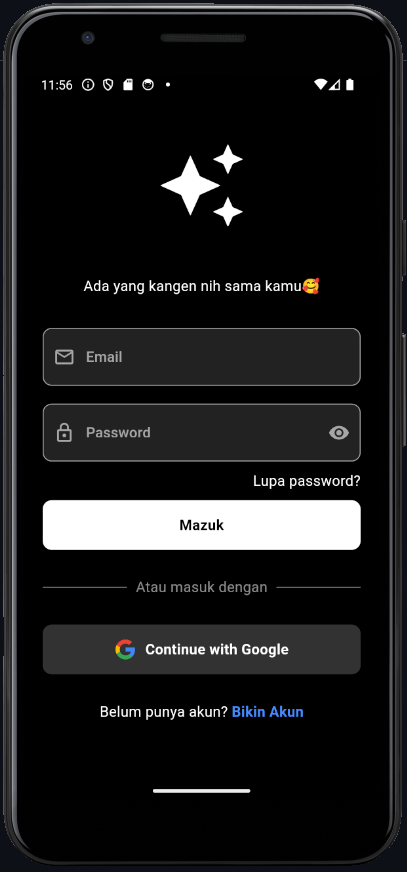
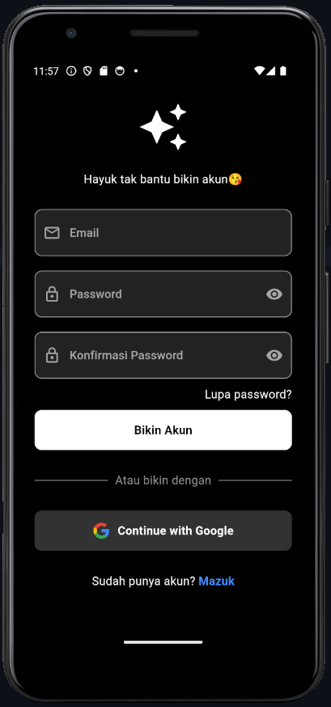
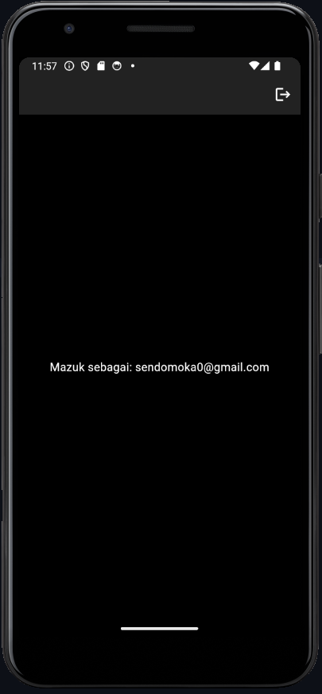

# flutauth

Simple Auth app using Flutter and Firebase.

Connect Firebase to Android: https://youtu.be/VjdOuHMPeAo?si=Bwg2kCVJfNOhDEAJ

| Screen | Image |
|---|---|
| Login |  |
| Register |  |
| Home |  |
